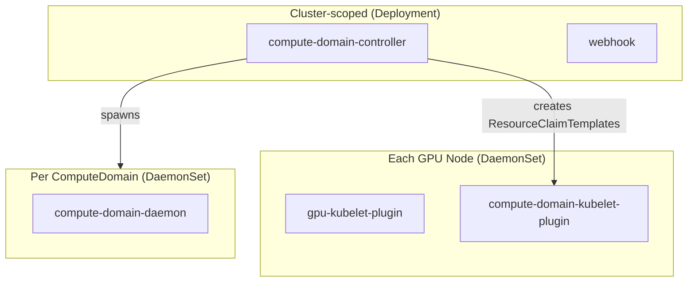
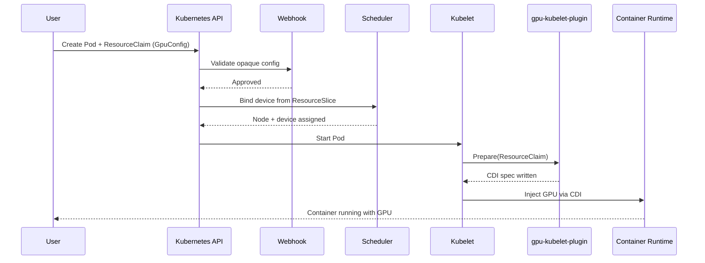
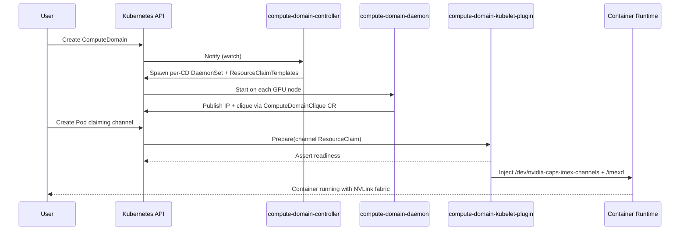

This repo ships two independent Kubernetes DRA drivers:

- `gpu.nvidia.com` - manages allocation of GPUs, including GPU sharing through MIG, Time-Slicing, and MPS, across both bare-metal and sandboxed environments.
- `compute-domain.nvidia.com` - manages IMEX daemons and allocation of IMEX channel devices required for GPU memory sharing across OS domains on Multi-Node NVLink systems.

Both are delivered by the Helm chart in [`deployments/helm/dra-driver-nvidia-gpu/`](https://github.com/kubernetes-sigs/dra-driver-nvidia-gpu/tree//deployments/helm/dra-driver-nvidia-gpu).

## Components

| Binary | Runs as | What it does |
|---|---|---|
| `gpu-kubelet-plugin` | DaemonSet, per node | Publishes GPU / MIG / VFIO `ResourceSlice`s and injects CDI on Prepare. |
| `compute-domain-kubelet-plugin` | Same DaemonSet, per node | Publishes IMEX daemon + channel devices and injects the IMEX mount on Prepare. |
| `compute-domain-controller` | Cluster Deployment | Watches `ComputeDomain` CRs; spawns a per-CD DaemonSet and the matching `ResourceClaimTemplate`s. |
| `compute-domain-daemon` | Per-CD DaemonSet, per node | Wraps and supervises `nvidia-imex`; reports peers. |
| `webhook` | Cluster Deployment | Validates opaque config on `ResourceClaim`s. |

## GPU request flow

Pod → `ResourceClaim` with a `GpuConfig` / `MigDeviceConfig` / `VfioDeviceConfig` → webhook validates → scheduler binds a device advertised by the GPU plugin → kubelet calls Prepare → plugin writes a CDI spec → runtime injects the GPU into the container.

## ComputeDomain flow

User creates a `ComputeDomain` → controller creates a per-CD DaemonSet → each daemon pod runs `nvidia-imex` → daemons publish their IP and clique through `ComputeDomainClique` CRs → workload pods claim a channel from the `compute-domain-default-channel.nvidia.com` DeviceClass → the CD kubelet plugin asserts readiness and injects `/dev/nvidia-caps-imex-channels/chan*` plus `/imexd` into the container.

## Reference

For opaque config types and CRD definitions: [API reference](../reference/api/)

For available feature flags and their defaults: [Feature gates](../reference/feature-gates/)

For Helm configuration: [Helm chart values](../reference/helm-values/)

For DeviceClasses shipped by the chart: [`deviceclass-*.yaml`](https://github.com/kubernetes-sigs/dra-driver-nvidia-gpu/tree//deployments/helm/dra-driver-nvidia-gpu/templates)

For example workloads: [`demo/specs/quickstart/`](https://github.com/kubernetes-sigs/dra-driver-nvidia-gpu/tree//demo/specs/quickstart)