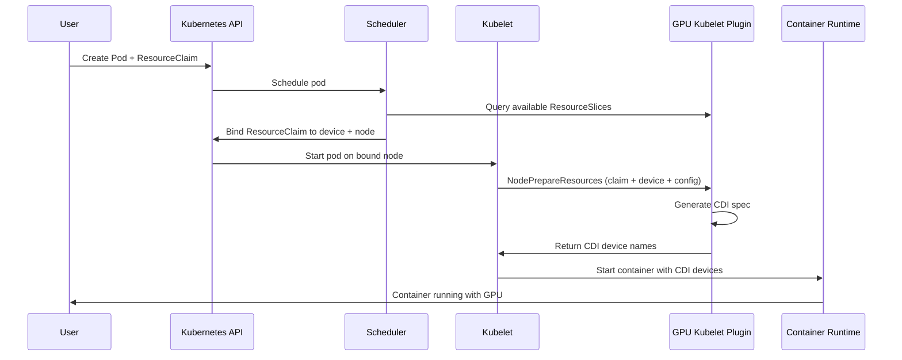

The DRA Driver for NVIDIA GPUs exposes three types of GPU resources, each suited to different workload requirements. This page explains what they are, how they differ, and how Kubernetes schedules them.

| DeviceClass | Resource type | Use case |
|---|---|---|
| `gpu.nvidia.com` | Full GPU | Exclusive or shared access to a single physical GPU |
| `mig.nvidia.com` | MIG slice | Hardware-isolated partition of a supported GPU |
| `vfio.gpu.nvidia.com` | VFIO passthrough | Raw GPU access for workloads that manage the driver themselves |

---

## Resource types

### Full GPUs

A full GPU gives a container exclusive access to a single physical GPU. This is the default allocation mode and requires no additional configuration.

Full GPUs support two optional sharing strategies for cases where you want to divide the GPU across multiple containers:

- **Time-slicing:** containers take turns on the GPU using CUDA preemption. Requires the `TimeSlicingSettings` feature gate.
- **MPS (Multi-Process Service):** containers run concurrently with configurable thread percentage and memory limits. Requires the `MPSSupport` feature gate.

Target DeviceClass: `gpu.nvidia.com`

See [`demo/specs/quickstart/`](https://github.com/kubernetes-sigs/dra-driver-nvidia-gpu/tree//demo/specs/quickstart) for configuration examples.

---

### MIG slices

MIG (Multi-Instance GPU) partitions a MIG-capable NVIDIA data center GPU (such as A100, A30, H100, and newer) into independent hardware slices. Each slice has its own dedicated compute engines, memory bandwidth, and L2 cache — workloads are fully isolated at the hardware level.

Unlike time-slicing and MPS, MIG partitioning is enforced by the GPU hardware itself. A container claiming a MIG slice cannot be affected by activity on another slice of the same physical GPU.

MIG slices are identified by profiles such as `1g.5gb` or `3g.20gb`, where the first number is the fraction of GPU compute and the second is the dedicated memory allocation. The available profiles depend on the physical GPU model.

#### Static and dynamic MIG

MIG support has two modes:

- **Static MIG:** the node administrator pre-configures MIG partitions using
  `mig-parted` or `nvidia-smi`. The driver discovers existing partitions and
  exposes them as allocatable devices. This is enabled by default; no feature
  gate is required.
- **Dynamic MIG:** the driver creates and destroys partitions automatically
  based on workload requests. Requires the `DynamicMIG` feature gate.

Static and dynamic MIG differ only in *who* creates the partitions, not in how
you request them. The same `ResourceClaimTemplate` and pod manifests work in
both modes.

#### How static MIG discovery works

Static MIG requires no feature gate and no MIG-specific driver configuration.
The driver always discovers pre-configured MIG partitions, so a default install
(`resources.gpus.enabled=true`) is all that is needed on the driver side. All of
the setup happens on the node, before the driver starts.

The GPU kubelet plugin discovers partitions at startup and advertises each one as
a device in the node's `ResourceSlice`:

- Discovery is a point-in-time snapshot. Partitions added or changed after the
  driver starts are not picked up until the GPU kubelet plugin restarts.
- MIG mode enabled with no partitions strands the GPU. If a GPU has MIG mode
  enabled but no partitions configured, the driver advertises neither the full
  GPU nor any slices for it, and logs a warning.

#### How dynamic MIG works

With dynamic MIG, the driver creates and destroys partitions automatically based
on workload requests, so you do not pre-configure them on the node.

Dynamic MIG builds on the Kubernetes partitionable devices feature (KEP-4815).
It works in three phases:

1. **Advertise every possible partition.** At startup, the GPU kubelet plugin
   enumerates all MIG profiles and every valid placement for each profile on
   each GPU, then advertises all of them in the node's `ResourceSlice`, even
   though none exist on the hardware yet. Alongside the devices, it publishes
   shared counters (one set per physical GPU) that track compute, memory, and
   memory-slice usage. Each advertised partition declares how much of those
   counters it would consume. This lets the scheduler allocate a partition that
   does not yet exist, and prevents handing out two partitions that would
   physically overlap on the same GPU.
2. **Create the partition on demand.** After the scheduler allocates a partition
   to a pod, the GPU kubelet plugin creates the actual MIG device when it
   prepares the pod's resources on the node — enabling MIG mode on the GPU if
   needed, then creating the GPU instance and compute instance for the requested
   profile and placement.
3. **Destroy the partition when it is no longer needed.** When the claim is
   released, the driver tears the MIG device back down. The plugin uses a
   node-local checkpoint as the source of truth, so it can reclaim partitions
   left behind by a crash or partial preparation when it restarts.

A request can be satisfied even when no matching partition was pre-configured —
the driver creates one to match.

MIG slices support both time-slicing and MPS sharing, using the same strategies as full GPUs. Time-slicing on MIG slices does not support interval configuration.

Target DeviceClass: `mig.nvidia.com`

See the [Request full GPUs guide](../guides/gpu-allocation/allocating-gpus.md) and
[`demo/specs/quickstart/`](https://github.com/kubernetes-sigs/dra-driver-nvidia-gpu/tree//demo/specs/quickstart)
for GPU configuration examples. For MIG setup and workload examples, see the [MIG guide](../guides/gpu-allocation/mig.md).

---

### VFIO passthrough

VFIO (Virtual Function I/O) passes a full physical GPU directly to a container, bypassing the NVIDIA driver stack in the host kernel. This gives the container raw hardware access and is intended for workloads that manage the GPU driver themselves, such as virtual machine managers or specialized research environments.

VFIO passthrough has no sharing options; one container gets one GPU.

Target DeviceClass: `vfio.gpu.nvidia.com`

Requires the `PassthroughSupport` feature gate (Alpha, default: false). See [Feature gates](../reference/feature-gates.md) to enable it.

---

## Choosing a resource type

| | Full GPU | MIG slice | VFIO passthrough |
|---|---|---|---|
| Hardware isolation | No | Yes | Full device |
| Sharing supported | Yes (time-slicing or MPS) | Yes (time-slicing or MPS) | No |
| Supported hardware | All NVIDIA GPUs | MIG-capable data center GPUs (A100, A30, H100, and newer) | All NVIDIA GPUs |
| Feature gate required | No (sharing gates optional) | No | `PassthroughSupport` (Alpha) |
| Typical use case | ML training, general workloads | Multi-tenant inference, strict isolation | VM passthrough, specialized environments |

---

## How scheduling works

When a pod references a `ResourceClaim`, Kubernetes uses the following flow to allocate and inject the GPU:

The key components in this flow:

- **ResourceSlice:** the kubelet plugin publishes each node's GPU devices in a single pool (one or more ResourceSlices), advertising the devices it makes allocatable and their attributes.
- **ResourceClaim:** the user's request for a specific type of GPU device, optionally with a configuration (GpuConfig, MigDeviceConfig, or VfioDeviceConfig) embedded as opaque parameters.
- **CDI (Container Device Interface):** the standard used to inject devices into containers. The kubelet plugin generates a CDI spec at prepare time; the container runtime reads it to set up the device files, environment variables, and mounts.

---

## Publishing GPUs in ResourceSlices

The GPU kubelet plugin discovers the GPUs on each node and publishes them as `ResourceSlice` objects. One pool per node, all under the `gpu.nvidia.com` driver. The make up of a `ResourceSlice` depends on how each GPU is configured:

- A GPU available as a full device is published with device `type: gpu` and you can request it through the `gpu.nvidia.com` DeviceClass.
- A GPU with MIG mode enabled is published as its MIG slices instead of a full GPU. Each MIG slice is assigned `type: mig` and you can request it through the `mig.nvidia.com` DeviceClass. With dynamic MIG, the driver also advertises every possible MIG partition plus per-GPU shared counters. See [How dynamic MIG works](#how-dynamic-mig-works) above.
- A GPU prepared for VFIO passthrough is published with device `type: vfio` and you can request it through the `vfio.gpu.nvidia.com` DeviceClass.

The driver discovers the node's GPUs once, when the GPU kubelet plugin starts, and that inventory stays fixed while the plugin runs. It republishes `ResourceSlices` at runtime to reflect allocation, as devices are claimed and released, and, if `NVMLDeviceHealthCheck` is enabled, device health changes. The GPU kubelet plugin does not re-scan hardware. If you make a manual change to a node's GPU or MIG configuration, for example, reconfiguring MIG with `nvidia-smi`, you must restart the GPU kubelet plugin for the changes to take effect in the resource pool.

The `ResourceSlices` contain the attributes and capacity details for all the GPUs on your cluster. To review the `ResourceSlices` on your cluster, see [View available GPU resources](../guides/gpu-allocation/view-resources.md); for what each attribute and capacity field means, see [ResourceSlice device attributes](../reference/resourceslice-attributes.md).

## Requesting a GPU

Resource request contains the following information:

*  A `ResourceClaimTemplate` (or `ResourceClaim`) references one of the available DeviceClasses
* Optionally, CEL selectors match the GPU attributes your workload requires
* Optionally, an opaque driver configuration block for `GpuConfig`, `MigDeviceConfig`, or `VfioDeviceConfig` sharing and device behavior.

The scheduler uses these details to pick a matching device from the node's ResourceSlice.

Refer to the [Kubernetes DRA documentation](https://kubernetes.io/docs/concepts/scheduling-eviction/dynamic-resource-allocation/) for details on the  claim and templating mechanics.

For more details on using these with the DRA, refer to the how-to guides:

- [Request full GPUs](../guides/gpu-allocation/allocating-gpus.md)
- [View available GPU resources](../guides/gpu-allocation/view-resources.md)
- [MIG](../guides/gpu-allocation/mig.md)
- [Time-slicing](../guides/gpu-allocation/time-slicing.md)
- [VFIO GPU passthrough](../guides/gpu-allocation/kubevirt-vfio-gpu-passthrough.md)