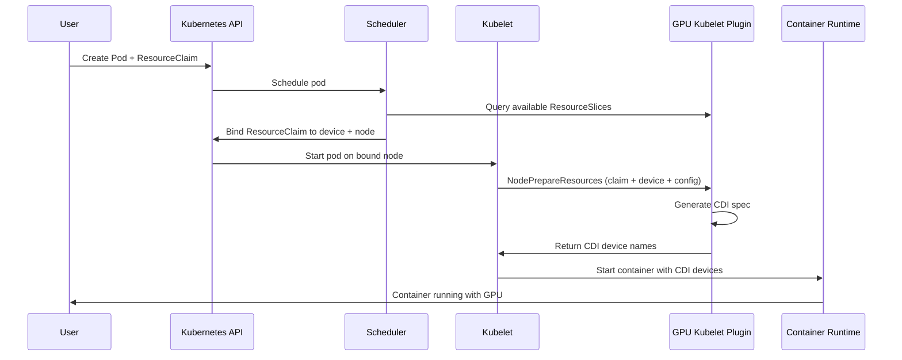

The DRA Driver for NVIDIA GPUs exposes three types of GPU resources, each suited to different workload requirements. This page explains what they are, how they differ, and how Kubernetes schedules them.

| DeviceClass | Resource type | Use case |
|---|---|---|
| `gpu.nvidia.com` | Full GPU | Exclusive or shared access to a single physical GPU |
| `mig.nvidia.com` | MIG slice | Hardware-isolated partition of a supported GPU |
| `vfio.gpu.nvidia.com` | VFIO passthrough | Raw GPU access for workloads that manage the driver themselves |

---

## Resource types

### Full GPUs

A full GPU gives a container exclusive access to a single physical GPU. This is the default allocation mode and requires no additional configuration.

Full GPUs support two optional sharing strategies for cases where you want to divide the GPU across multiple containers:

- **Time-slicing:** containers take turns on the GPU using CUDA preemption. Requires the `TimeSlicingSettings` feature gate.
- **MPS (Multi-Process Service):** containers run concurrently with configurable thread percentage and memory limits. Requires the `MPSSupport` feature gate.

Target DeviceClass: `gpu.nvidia.com`

See [`demo/specs/quickstart/`](https://github.com/kubernetes-sigs/dra-driver-nvidia-gpu/tree//demo/specs/quickstart) for configuration examples.

---

### MIG slices

MIG (Multi-Instance GPU) partitions a supported GPU (H100, A100, and newer) into independent hardware slices. Each slice has its own dedicated compute engines, memory bandwidth, and L2 cache — workloads are fully isolated at the hardware level.

Unlike time-slicing and MPS, MIG partitioning is enforced by the GPU hardware itself. A container claiming a MIG slice cannot be affected by activity on another slice of the same physical GPU.

MIG slices are identified by profiles such as `1g.5gb` or `3g.20gb`, where the first number is the fraction of GPU compute and the second is the dedicated memory allocation. The available profiles depend on the physical GPU model.

MIG slices support both time-slicing and MPS sharing, using the same strategies as full GPUs. Time-slicing on MIG slices does not support interval configuration.

Target DeviceClass: `mig.nvidia.com`

See [`demo/specs/quickstart/`](https://github.com/kubernetes-sigs/dra-driver-nvidia-gpu/tree//demo/specs/quickstart) for MIG configuration examples.

---

### VFIO passthrough

VFIO (Virtual Function I/O) passes a full physical GPU directly to a container, bypassing the NVIDIA driver stack in the host kernel. This gives the container raw hardware access and is intended for workloads that manage the GPU driver themselves, such as virtual machine managers or specialized research environments.

VFIO passthrough has no sharing options; one container gets one GPU.

Target DeviceClass: `vfio.gpu.nvidia.com`

Requires the `PassthroughSupport` feature gate (Alpha, default: false). See [Feature gates](../reference/feature-gates/) to enable it.

---

## Choosing a resource type

| | Full GPU | MIG slice | VFIO passthrough |
|---|---|---|---|
| Hardware isolation | No | Yes | Full device |
| Sharing supported | Yes (time-slicing or MPS) | Yes (time-slicing or MPS) | No |
| Supported hardware | All NVIDIA GPUs | H100, A100, and newer | All NVIDIA GPUs |
| Feature gate required | No (sharing gates optional) | No | `PassthroughSupport` (Alpha) |
| Typical use case | ML training, general workloads | Multi-tenant inference, strict isolation | VM passthrough, specialized environments |

---

## How scheduling works

When a pod references a `ResourceClaim`, Kubernetes uses the following flow to allocate and inject the GPU:



The key components in this flow:

- **ResourceSlice:** the kubelet plugin publishes one ResourceSlice per node, advertising all available GPU devices and their attributes.
- **ResourceClaim:** the user's request for a specific type of GPU device, optionally with a configuration (GpuConfig, MigDeviceConfig, or VfioDeviceConfig) embedded as opaque parameters.
- **CDI (Container Device Interface):** the standard used to inject devices into containers. The kubelet plugin generates a CDI spec at prepare time; the container runtime reads it to set up the device files, environment variables, and mounts.

---

## Requesting a GPU

All GPU requests follow the same pattern: a `ResourceClaimTemplate` referencing a DeviceClass, with an optional opaque configuration block.

Basic request for a full GPU:

```yaml
apiVersion: resource.k8s.io/v1         # Kubernetes 1.34+
# apiVersion: resource.k8s.io/v1beta2  # Kubernetes 1.32 and 1.33
kind: ResourceClaimTemplate
metadata:
  name: single-gpu
spec:
  spec:
    devices:
      requests:
      - name: gpu
        exactly:
          deviceClassName: gpu.nvidia.com
```

Reference it from a pod:

```yaml
spec:
  containers:
  - name: workload
    resources:
      claims:
      - name: gpu
  resourceClaims:
  - name: gpu
    resourceClaimTemplateName: single-gpu
```

The scheduler selects an available device from the node's ResourceSlice that matches the DeviceClass. If a CEL selector is included in the request, only devices matching the expression are eligible.

For configuration examples covering sharing strategies, MIG profiles, and VFIO, see the how-to pages linked above.